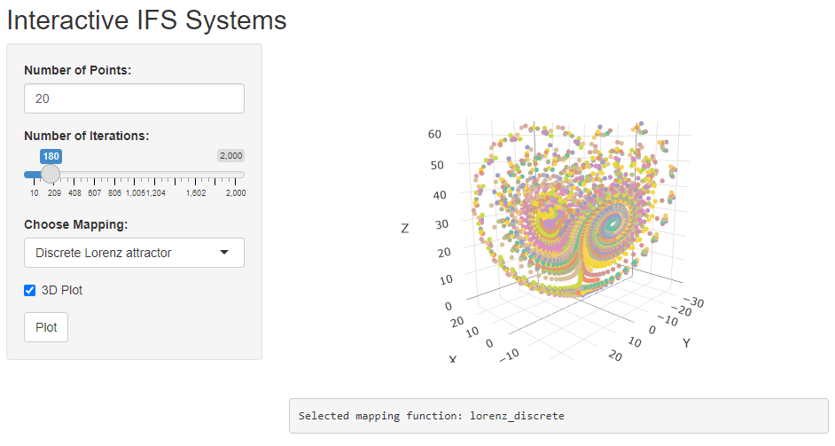

# Dynamic Systems and Chaos Visualization

This repository contains scripts for generating and visualizing various dynamic and chaotic systems. These scripts implement mathematical models that demonstrate complex behaviors, providing insights into the fascinating world of chaos theory and dynamic systems.

## Overview

Dynamic systems and chaos theory explore the behavior of systems that evolve overtime according to a set of rules. These systems can exhibit a wide range of behaviors, from predictable and periodic to highly irregular and chaotic. This repository aims to provide a collection of scripts to model and visualize such behaviors.

## Contents

### Current Scripts

1. **Gingerbreadman Map**:
   - **Description**: Visualizes the Gingerbreadman map, a type of chaotic map from R^2 to R^2. Generates orbits of the map using randomly generated starting points.
   - **Dependencies**: `latex2exp`
   - **Location**: `Gingerbreadman/`

2. **Iterated Function Systems (IFS)**:
   - **Description**: Repeatedly applies a mapping function to visualize iterated function systems. Supports 1-3 dimensional mappings with variables x, y, z. Users can add their own mapping functions.
   - **Dependencies**: `tidyverse`, `ggplot2`, `plotly`, `shiny`
   - **Location**: `IFS/`
   - **Shiny App**: An interactive UI is available in `IFS_shiny/` and can be accessed at [IFS Shiny App](https://sgt1796.shinyapps.io/IFS_shiny/)

3. **Unknown Function f(a, b, c)**:
   - **Description**: Computes and visualizes the values of an unknown function f(a, b, c) mapping from R^3 to R.  Analyzes the long-term behavior of the function by fixing different parameters.
   - **Dependencies**: `ggplot2`, `plotly`, `dplyr`, `tibble`, `reshape2`, `tidyr`
   - **Location**: `unknown_mapping1/`

## Requirements

- R
- Required packages: `tidyverse`, `ggplot2`, `plotly`, `shiny`, `latex2exp`, `dplyr`, `tibble`, `reshape2`, `tidyr`

## Usage

### Iterated Function Systems (IFS)

The IFS script (`IFS.R`) now contains three primary functions:

1. **load_functions(mapping_list, file=<file_path>)**:
   - Loads mapping functions specified in the `mapping_list` from the given file.

2. **apply_functions(mapping, x, y, z)**:
   - Applies the specified mapping function to the input variables.

3. **iterate_functions(mapping_list, n_iterations, x, y, z)**:
   - Iteratively applies the loaded mapping functions for a specified number of iterations.

Example usage:
```r
# Clifford attractor function
clifford <- function(x, y, a = -1.4, b = 1.6, c = 1.0, d = 0.7) {
  xnew <- sin(a * y) + c * cos(a * x)
  ynew <- sin(b * x) + d * cos(b * y)
  return(list(x = xnew, y = ynew))
}

# Load this Clifford and another map together and iterate
functions <- load_functions(c("clifford", "rotation"), file = "mappings.R")
result <- iterate_functions(initial_points, iterations, functions)
```

### Adding New Mapping Functions

Users can add new mapping functions by defining them in a file and specifying the path in the `load_functions` function. Each mapping function should return a list of the form `list(x = ..., y = ..., z = ...)`.

Example:
```r
# New mapping function
new_map <- function(x, y, z, p = 1.2) {
  xnew <- x + p * sin(y)
  ynew <- y + p * cos(z)
  znew <- z + p * sin(x)
  return(list(x = xnew, y = ynew, z = znew))
}

# Save this function in a file (e.g., custom_mappings.R) and load it
functions <- load_functions("new_map", file = "custom_mappings.R")
result <- iterate_functions(initial_points, iterations, functions)
```

## Gallery

### Gingerbreadman Map


### Lorenz Discrete Map



### Rossler Discrete Map


### Dynamic System Animation


## TODO

- Improve interface for adding mapping functions.
- Implement Mandelbrot and Julia set generation.
- Add range control for the web UI.
- Enable switching variables for mapping functions.

## License

This project is licensed under the GPL-3.0 License. See the [LICENSE](LICENSE) file for details.


Feel free to contribute to the project by adding new scripts, improving existing ones, or suggesting new features.
